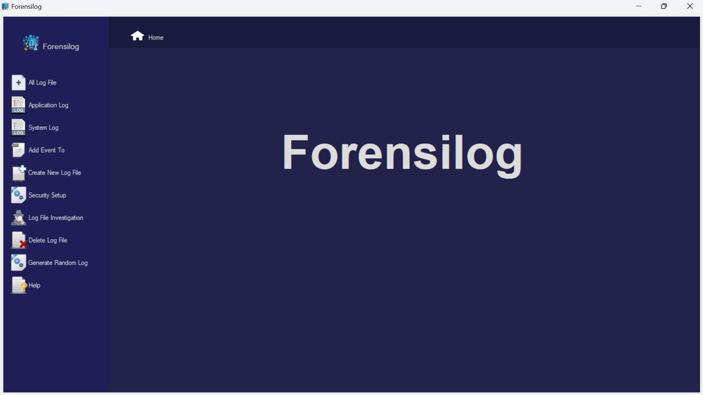

# Forensilog

Forensilog is a sophisticated tool designed for the analysis and modification of Windows Event Log files. Developed with a user-friendly C# GUI, Forensilog allows users to work with and manage Windows log files efficiently, enhancing their ability to conduct thorough forensic investigations and system audits.

**Note**: It is highly recommended to read the documentation before using this tool to ensure effective and correct usage.

## Functionality

1. **View Windows Event Log Files**: Easily access and read event log files.
2. **Modify Log Files**: Edit and update log file entries as needed.  
3. **Create or Delete Log Files**: Generate new log files or remove existing ones.
4. **Delete All Logs from a File**: Clear all entries within a log file.
5. **Generate Random Log Files**: Create log files with randomly generated data.
6. **Analyze Log Files**: Add tags and notable items for detailed analysis.
7. **Manage Baselines**: Create, update, and delete baselines of log files to ensure security and detect any new or altered logs.
8. **Generate Reports**: Produce comprehensive reports based on the analysis of log files.

## Features

1. **Home Page**: 
   - Provides access to various functions like adding or deleting log files.
   

2. **Log File Table**:
   - Displays available log files in the system on the home page.
   
3. **Application Log Tab**:
   - Add, view, and delete application log files. Similar functionality is available for system logs.
   
4. **Investigation Tab**:
   - Add log files and investigator details, then tag events and add notable items for thorough investigation.
   
5. **Investigator Details**:
   - Manage and add details of investigators along with relevant information.
   
6. **Log and Item Management**:
   - View and add log files, notable items, and tagged items.
   
7. **Security Assessment Page**:
   - This page is critical for security assessments and requires careful reading of the documentation for proper use.
   
8. **Final Report**:
   - Generate a comprehensive report of the investigation.
   
Forensilog provides a powerful set of tools for managing Windows Event Log files, making it an invaluable asset for forensic and security professionals. Be sure to consult the detailed documentation to make the most of its extensive features.

Contributors:

To list these as contributors to a GitHub repository, you can format it like this:

**Contributors:**
- [Mishqatabid](https://github.com/mishqatabid)
- [Nahl16](https://github.com/nahl16)
- [H4x3r-222](https://github.com/h4x3r-222) 

